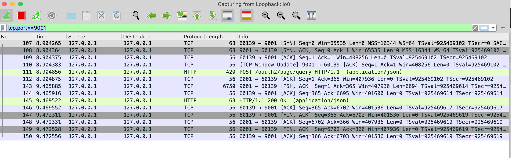
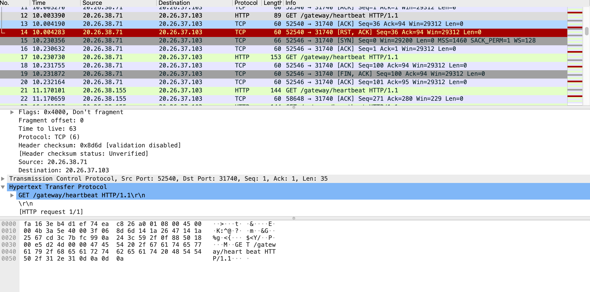

- [Tcpdump安装](#Tcpdump安装)
- [Tcpdump命令说明](#Tcpdump命令说明)
- [Tcpdump命令和使用](#Tcpdump命令和使用)
- [Tcpdump原理分析](#Tcpdump原理分析)
- [Tcpdump介绍](#Tcpdump介绍)
- [Wireshark介绍](#Wireshark介绍)
- [如何快速获取抓包文件中HTTP请求的响应时间](#如何快速获取抓包文件中HTTP请求的响应时间)
- [使用Tcpdump和Wireshark抓包分析](#使用Tcpdump和Wireshark抓包分析)
    - [一次完整HTTP请求流程的抓包记录和分析](#一次完整HTTP请求流程的抓包记录和分析)
    - [HAProxy心跳检查问题](#HAProxy心跳检查问题)
    - [TCP协议的RST标志位](#TCP协议的RST标志位)

---------------------------------------------------------------------------------------------------------------------
## Tcpdump安装

基础依赖软件
yum -y install flex  
yum -y install bison  
yum -y install gcc  

cd /var/install/  
wget http://www.tcpdump.org/release/libpcap-1.5.3.tar.gz  
wget http://www.tcpdump.org/release/tcpdump-4.5.1.tar.gz  

tar -zxvf libpcap-1.5.3.tar.gz  
cd libpcap-1.5.3  
./configure  
make && make install
  
cd ..  
tar -zxvf tcpdump-4.5.1.tar.gz  
cd tcpdump-4.5.1  
./configure  
make && make install 

参考 [tcpdump安装配置及抓包分析](https://blog.csdn.net/small____fish/article/details/51360991)

---------------------------------------------------------------------------------------------------------------------
## Tcpdump命令说明

选项
tcpdump 的选项也很多，要想知道所有选项的话，请参考 man tcpdump，下面只记录 tcpdump 最常用的选项。

需要注意的是，tcpdump 默认只会截取前 96 字节的内容，要想截取所有的报文内容，可以使用 -s number， number 就是你要截取的报文字节数，如果是 0 的话，表示截取报文全部内容。

- -n 表示不要解析域名，直接显示 ip。
- -nn 不要解析域名和端口
- -X 同时用 hex 和 ascii 显示报文的内容。
- -XX 同 -X，但同时显示以太网头部。
- -S 显示绝对的序列号（sequence number），而不是相对编号。
- -i any 监听所有的网卡
- -v, -vv, -vvv：显示更多的详细信息
- -c number: 截取 number 个报文，然后结束
- -A： 只使用 ascii 打印报文的全部数据，不要和 -X 一起使用。截取 http 请求的时候可以用 sudo tcpdump -nSA port 80！

简单使用

1. tcpdump -nS
   监听所有端口，直接显示 ip 地址。

2. tcpdump -nnvvS
   显示更详细的数据报文，包括 tos, ttl, checksum 等。

3. tcpdump -nnvvXS
   显示数据报的全部数据信息，用 hex 和 ascii 两列对比输出。

比如：

sudo tcpdump -nnvXSs 0 -c2 icmp

tcpdump port 8080 -X -XX -S

### 过滤器

过滤器也可以简单地分为三类：type, dir 和 proto。

Type 让你区分报文的类型，主要由 host（主机）, net（网络） 和 port（端口） 组成。src 和 dst 也可以用来过滤报文的源地址和目的地址。

host: 过滤某个主机的数据报文
tcpdump host 1.2.3.4

src, dst: 过滤源地址和目的地址
tcpdump src 2.3.4.5
tcpdump dst 3.4.5.6

net: 过滤某个网段的数据，CIDR 模式
tcpdump net 1.2.3.0/24

proto: 过滤某个协议的数据，支持 tcp, udp 和 icmp。使用的时候可以省略 proto 关键字。
tcpdump icmp

port: 过滤通过某个端口的数据报
tcpdump port 3389

src/dst, port, protocol: 结合三者
tcpdump src port 1025 and tcp
tcpdump udp and src port 53

此外还有指定端口和数据报文范围的过滤器：

port 范围
tcpdump portrange 21-23

数据报大小，单位是字节
tcpdump less 32
tcpdump greater 128
tcpdump > 32
tcpdump <= 128

过于过滤器的更多详细信息，请访问 tcpdump 官方 map page 的 [PCAP-FILTER 部分](http://www.tcpdump.org/manpages/pcap-filter.7.html)

### 输出到文件

使用 tcpdump 截取数据报文的时候，默认会打印到屏幕的默认输出，你会看到按照顺序和格式，很多的数据一行行快速闪过，根本来不及看清楚所有的内容。不过，tcpdump 提供了把截取的数据保存到文件的功能，以便后面使用其他图形工具（比如 wireshark，Snort）来分析。

-w 选项用来把数据报文输出到文件，比如下面的命令就是把所有 80 端口的数据导入到文件
# sudo tcpdump -w capture_file.pcap port 80

-r 可以读取文件里的数据报文，显示到屏幕上。
# tcpdump -nXr capture_file.pcap host web30

NOTE：保存到文件的数据不是屏幕上看到的文件信息，而是包含了额外信息的固定格式 pcap，需要特殊的软件来查看，使用 vim 或者 cat 命令会出现乱码。

### 强大的过滤器

过滤的真正强大之处在于你可以随意组合它们，而连接它们的逻辑就是常用的 与/AND/&& 、 或/OR/|| 和 非/not/!。

源地址是 10.5.2.3，目的端口是 3389 的数据报
tcpdump -nnvS src 10.5.2.3 and dst port 3389

从 192.168 网段到 10 或者 172.16 网段的数据报
tcpdump -nvX src net 192.168.0.0/16 and dat net 10.0.0.0/8 or 172.16.0.0/16

从 Mars 或者 Pluto 发出的数据报，并且目的端口不是 22
tcpdump -vv src mars or pluto and not dat port 22

从上面的例子就可以看出，你可以随意地组合之前的过滤器来截取自己期望的数据报，最重要的就是知道自己要精确匹配的数据室怎样的！

对于比较复杂的过滤器表达式，为了逻辑的清晰，可以使用括号。不过默认情况下，tcpdump 把 () 当做特殊的字符，所以必须使用单引号 ' 来消除歧义：

tcpdump -nvv -c 20 'src 10.0.2.4 and (dat port 3389 or 22)'

[抓包神器 tcpdump 使用介绍](https://cizixs.com/2015/03/12/tcpdump-introduction/)  
[超详细的网络抓包神器 tcpdump 使用指南](https://juejin.cn/post/6844904084168769549)  
[tcpdump使用](https://tonydeng.github.io/sdn-handbook/linux/tcpdump.html)  

---------------------------------------------------------------------------------------------------------------------

## Tcpdump命令和使用

tcpdump是用来抓取数据非常方便，Wireshark则是用于分析抓取到的数据比较方便。

开启混杂模式的命令是：ifconfig en0 promisc, en0是你要打开混杂模式的网卡。

1、直接启动tcpdump，将抓取所有经过第一个网络接口上的数据包，一般是eth0
tcpdump

2、抓取所有经过指定网络接口上的数据包
tcpdump -i en0

3、抓取所有经过 en0，目的或源地址是 10.37.63.255 的网络数据：
tcpdump -i en0 host 10.37.63.255

tcpdump  -i lo host 10.21.20.107 and tcp port 31100 -w ../test/test2.pcap 
netstat -anp | grep 52729

4、抓取主机10.37.63.255和主机10.37.63.61或10.37.63.95的通信：
tcpdump host 10.37.63.255 and (10.37.63.61 or 10.37.63.95)

5、抓取主机192.168.13.210除了和主机10.37.63.61之外所有主机通信的数据包：
tcpdump -n host 10.37.63.255 and !10.37.63.61

6、抓取主机10.37.63.255除了和主机10.37.63.61之外所有主机通信的ip包
tcpdump ip -n host 10.37.63.255 and !10.37.63.61

7、抓取主机10.37.63.3发送的所有数据：
tcpdump -i en0 src host 10.37.63.3

8、抓取主机10.37.63.3接收的所有数据：
tcpdump -i en0 dst host 10.37.63.3

参考  
https://www.jianshu.com/p/8d9accf1d2f1  
https://www.cnblogs.com/pyng/p/9698723.html  

---------------------------------------------------------------------------------------------------------------------
## Tcpdump原理分析

1 起因

前段时间，一直在调线上的一个问题：线上应用接受POST请求，请求body中的参数获取不全，存在丢失的状况。这个问题是偶发性的，大概发生的几率为5%-10%左右，这个概率已经相当高了。在排查问题的过程中使用到了tcpdump和Wireshark进行抓包分析。感觉这两个工具搭配起来干活，非常完美。所有的网络传输在这两个工具搭配下，都无处遁形。

为了更好、更顺手地能够用好这两个工具，特整理本篇文章，希望也能给大家带来收获。为大家之后排查问题，添一利器。

2 tcpdump与Wireshark介绍

在网络问题的调试中，tcpdump应该说是一个必不可少的工具，和大部分linux下优秀工具一样，它的特点就是简单而强大。它是基于Unix系统的命令行式的数据包嗅探工具，可以抓取流动在网卡上的数据包。

默认情况下，tcpdump不会抓取本机内部通讯的报文。根据网络协议栈的规定，对于报文，即使是目的地是本机，也需要经过本机的网络协议层，所以本机通讯肯定是通过API进入了内核，并且完成了路由选择。【比如本机的TCP通信，也必须要socket通信的基本要素：src ip port dst ip port】

如果要使用tcpdump抓取其他主机MAC地址的数据包，必须开启网卡混杂模式，所谓混杂模式，用最简单的语言就是让网卡抓取任何经过它的数据包，不管这个数据包是不是发给它或者是它发出的。一般而言，Unix不会让普通用户设置混杂模式，因为这样可以看到别人的信息，比如telnet的用户名和密码，这样会引起一些安全上的问题，所以只有root用户可以开启混杂模式，开启混杂模式的命令是：ifconfig en0 promisc, en0是你要打开混杂模式的网卡。

Linux抓包原理：

Linux抓包是通过注册一种虚拟的底层网络协议来完成对网络报文(准确的说是网络设备)消息的处理权。当网卡接收到一个网络报文之后，它会遍历系统中所有已经注册的网络协议，例如以太网协议、x25协议处理模块来尝试进行报文的解析处理，这一点和一些文件系统的挂载相似，就是让系统中所有的已经注册的文件系统来进行尝试挂载，如果哪一个认为自己可以处理，那么就完成挂载。

当抓包模块把自己伪装成一个网络协议的时候，系统在收到报文的时候就会给这个伪协议一次机会，让它来对网卡收到的报文进行一次处理，此时该模块就会趁机对报文进行窥探，也就是把这个报文完完整整的复制一份，假装是自己接收到的报文，汇报给抓包模块。

Wireshark是一个网络协议检测工具，支持Windows平台、Unix平台、Mac平台，一般只在图形界面平台下使用Wireshark，如果是Linux的话，直接使用tcpdump了，因为一般而言Linux都自带的tcpdump，或者用tcpdump抓包以后用Wireshark打开分析。

在Mac平台下，Wireshark通过WinPcap进行抓包，封装的很好，使用起来很方便，可以很容易的制定抓包过滤器或者显示过滤器，具体简单使用下面会介绍。Wireshark是一个免费的工具，只要google一下就能很容易找到下载的地方。

所以，tcpdump是用来抓取数据非常方便，Wireshark则是用于分析抓取到的数据比较方便。

作者：meng_philip123
链接：https://www.jianshu.com/p/8d9accf1d2f1
来源：简书
著作权归作者所有。商业转载请联系作者获得授权，非商业转载请注明出处。

---------------------------------------------------------------------------------------------------------------------
## Tcpdump介绍

[tcpdump官网](https://www.tcpdump.org/)

tcpdump：
保存到target.cap文件，可以使用Wireshark打开文件
tcpdump -i en4 port 8101 -U -w ./target.cap
tcpdump tcp port 8101 -n -X -s 0

tcpdump  tcp port 8001 -w tcpdump5.cap

wireshark：在mac上选择lo0网卡监听127.0.0.1
http  and  tcp.port == 8101

tcpdump使用
https://www.cnblogs.com/ggjucheng/archive/2012/01/14/2322659.html

---------------------------------------------------------------------------------------------------------------------
## Wireshark介绍

[Wireshark官网](https://www.wireshark.org/)  
[Wireshark Github](https://github.com/wireshark/wireshark)  

[Wireshark中文使用教程（用户版）](https://www.wangan.com/docs/wiresharkuser)  
[wireshark抓包新手使用教程](https://www.cnblogs.com/linyfeng/p/9496126.html)  

### Wireshark实用过滤表达式  

[wireshark过滤规则及使用方法](https://blog.csdn.net/panda62/article/details/80279732)  
[wireshark 实用过滤表达式（针对ip、协议、端口、长度和内容）](https://blog.csdn.net/aflyeaglenku/article/details/50884296)  
[WireShark 过滤http请求](https://blog.csdn.net/zzy0609/article/details/95455136)  
  

http.host==magentonotes.com
http.host contains magentonotes.com
//过滤经过指定域名的http数据包，这里的host值不一定是请求中的域名

http.response.code==302
//过滤http响应状态码为302的数据包

http.response==1
//过滤所有的http响应包

http.request==1
//过滤所有的http请求，貌似也可以使用http.request

http.request.method==POST
//wireshark过滤所有请求方式为POST的http请求包，注意POST为大写

http.cookie contains guid
//过滤含有指定cookie的http数据包

http.request.uri==”/online/setpoint”
//过滤请求的uri，取值是域名后的部分

http.request.full_uri==” http://task.browser.360.cn/online/setpoint”
//过滤含域名的整个url则需要使用http.request.full_uri

http.server contains “nginx”
//过滤http头中server字段含有nginx字符的数据包

http.content_type == “text/html”
//过滤content_type是text/html的http响应、post包，即根据文件类型过滤http数据包

http.content_encoding == “gzip”
//过滤content_encoding是gzip的http包

http.transfer_encoding == “chunked”
//根据transfer_encoding过滤

http.content_length == 279
http.content_length_header == “279″
//根据content_length的数值过滤

http.server
//过滤所有含有http头中含有server字段的数据包

http.request.version == “HTTP/1.1″
//过滤HTTP/1.1版本的http包，包括请求和响应

http.response.phrase == “OK”
//过滤http响应中的phrase

---------------------------------------------------------------------------------------------------------------------
## 如何快速获取抓包文件中HTTP请求的响应时间

[如何快速获取抓包文件中HTTP请求的响应时间](https://cloud.tencent.com/developer/article/1657425)  
[Wireshark查看http响应时间的统计图](https://gmd20.github.io/blog/wireshark%E6%9F%A5%E7%9C%8Bhttp%E5%93%8D%E5%BA%94%E6%97%B6%E9%97%B4%E7%9A%84%E7%BB%9F%E8%AE%A1%E5%9B%BE/)  
  
  
  
  

## 用Wireshark抓包分析超过70秒的请求

[用Wireshark抓包分析超过70秒的请求](https://www.cnblogs.com/cmt/p/3789182.html)  
[Wireshark抓包分析一个耗时20秒的请求](https://blog.csdn.net/wuxing26jiayou/article/details/79855306)  
  
  
  

---------------------------------------------------------------------------------------------------------------------

## 使用Tcpdump和Wireshark抓包分析

### 一次完整HTTP请求流程的抓包记录和分析
   

107	8.904265	127.0.0.1	127.0.0.1	TCP	68	60139 → 9001 [SYN] Seq=0 Win=65535 Len=0 MSS=16344 WS=64 TSval=925469102 TSecr=0 SACK_PERM=1  
108	8.904364	127.0.0.1	127.0.0.1	TCP	68	9001 → 60139 [SYN, ACK] Seq=0 Ack=1 Win=65535 Len=0 MSS=16344 WS=64 TSval=925469102 TSecr=925469102 SACK_PERM=1  
109	8.904375	127.0.0.1	127.0.0.1	TCP	56	60139 → 9001 [ACK] Seq=1 Ack=1 Win=408256 Len=0 TSval=925469102 TSecr=925469102  
110	8.904383	127.0.0.1	127.0.0.1	TCP	56	[TCP Window Update] 9001 → 60139 [ACK] Seq=1 Ack=1 Win=408256 Len=0 TSval=925469102 TSecr=925469102  
111	8.904856	127.0.0.1	127.0.0.1	HTTP	420	POST /oauth2/page/query HTTP/1.1  (application/json)  
112	8.904875	127.0.0.1	127.0.0.1	TCP	56	9001 → 60139 [ACK] Seq=1 Ack=365 Win=407936 Len=0 TSval=925469102 TSecr=925469102  
143	9.465885	127.0.0.1	127.0.0.1	TCP	6750	9001 → 60139 [PSH, ACK] Seq=1 Ack=365 Win=407936 Len=6694 TSval=925469614 TSecr=925469102 [TCP segment of a reassembled PDU]  
144	9.465916	127.0.0.1	127.0.0.1	TCP	56	60139 → 9001 [ACK] Seq=365 Ack=6695 Win=401600 Len=0 TSval=925469614 TSecr=925469614  
145	9.469522	127.0.0.1	127.0.0.1	HTTP	63	HTTP/1.1 200 OK  (application/json)  
146	9.469552	127.0.0.1	127.0.0.1	TCP	56	60139 → 9001 [ACK] Seq=365 Ack=6702 Win=401536 Len=0 TSval=925469617 TSecr=925469617  
147	9.472311	127.0.0.1	127.0.0.1	TCP	56	60139 → 9001 [FIN, ACK] Seq=365 Ack=6702 Win=401536 Len=0 TSval=925469619 TSecr=925469617  
148	9.472331	127.0.0.1	127.0.0.1	TCP	56	9001 → 60139 [ACK] Seq=6702 Ack=366 Win=407936 Len=0 TSval=925469619 TSecr=925469619  
149	9.472528	127.0.0.1	127.0.0.1	TCP	56	9001 → 60139 [FIN, ACK] Seq=6702 Ack=366 Win=407936 Len=0 TSval=925469619 TSecr=925469619  
150	9.472556	127.0.0.1	127.0.0.1	TCP	56	60139 → 9001 [ACK] Seq=366 Ack=6703 Win=401536 Len=0 TSval=925469619 TSecr=925469619  

三次握手：
1. 60139 → 9001 [SYN] Seq=0 Win=65535 Len=0 MSS=16344 WS=64 TSval=925469102 TSecr=0 SACK_PERM=1  
2. 9001 → 60139 [SYN, ACK] Seq=0 Ack=1 Win=65535 Len=0 MSS=16344 WS=64 TSval=925469102 TSecr=925469102 SACK_PERM=1  
3. 60139 → 9001 [ACK] Seq=1 Ack=1 Win=408256 Len=0 TSval=925469102 TSecr=925469102  

四次挥手：
1. 60139 → 9001 [FIN, ACK] Seq=365 Ack=6702 Win=401536 Len=0 TSval=925469619 TSecr=925469617  
2. 9001 → 60139 [ACK] Seq=6702 Ack=366 Win=407936 Len=0 TSval=925469619 TSecr=925469619  
3. 9001 → 60139 [FIN, ACK] Seq=6702 Ack=366 Win=407936 Len=0 TSval=925469619 TSecr=925469619  
4. 60139 → 9001 [ACK] Seq=366 Ack=6703 Win=401536 Len=0 TSval=925469619 TSecr=925469619  

[使用WireShark查看TCP连接和断开过程](https://blog.csdn.net/yuanjize1996/article/details/83317436)
[TCP ------ 抓包分析（seq ack）](https://www.cnblogs.com/god-of-death/p/7905817.html)

### HAProxy心跳检查问题

问题：  
服务端总是报Connection reset by peer错误，报错量比较大，怀疑是程序有问题

手动发起健康监测调用  
curl -v http://20.26.37.103:31740/gateway/heartbeat--这样没有报错

haproxy现在发起的探测会出现Connection reset by peer

应该是/gateway/heartbeat这个服务对http请求的header、option都有要求

进行抓包查看网络情况

   

从图中我们可以看到，同样的请求，上面一次haproxy现在发起的探测采用[RST,ACK]替代了[FIN,ACK]，

看了下抓包数据，查了下资料，确实haproxy为了提高性能，在健康检查的时候采用[RST,ACK]替代了[FIN,ACK]

正常的TCP三次握手后，会进行数据传输，但是在健康检查时会发送RST中断建立的TCP连接。该实现方式可能会导致后端服务器中的应用认为TCP连接异常退出，并打印错误信息，如“Connection reset by peer”。

这种错误是合理范围内的，无法避免的，不必关心它。

1.4.23版本的haproxy在进行心跳检查后，关闭为了进行心跳时建立的tcp连接会发送一个RST分组。这个本身不会影响后端服务器的正常功能，但是绝大多数服务器收到这个分组后，会抛出异常，如果你的日志打印这种异常就会导致日志量很大（因为心跳很频繁，且每次心跳就会查收这个异常），且这种异常不容易定位，导致你”人心惶惶“！！！

1.4.24版本中修复了这个问题，它在心跳检查tcp连接时，没有达成三次握手，不向服务器发送最后一个ack分组，就马上发送RST分组，这样服务器认为连接没有建立，不会抛出异常。

参考  
[HAProxy——心跳检查问题](https://blog.csdn.net/lgxheartlikesea/article/details/16966115)  
[HAPROXY 1.5.4/1.5.18 is sending [RST, ACK] in for closure to httpchk instead of [FIN, ACK]](https://discourse.haproxy.org/t/haproxy-1-5-4-1-5-18-is-sending-rst-ack-in-for-closure-to-httpchk-instead-of-fin-ack/474)  

### TCP协议的RST标志位
TCP socket在任何状态下，只要收到RST包，即可进入CLOSED初始状态。

值得注意的是RST报文段不会导致另一端产生任何响应，另一端根本不进行确认。收到RST的一方将终止该连接。程序行为如下：
阻塞模型下，内核无法主动通知应用层出错，只有应用层主动调用read()或者write()这样的IO系统调用时，内核才会利用出错来通知应用层对端RST。

非阻塞模型下，select或者epoll会返回sockfd可读,应用层对其进行读取时，read()会报错RST。

RST标志位

RST表示复位，用来异常的关闭连接，在TCP的设计中它是不可或缺的。就像上面说的一样，发送RST包关闭连接时，不必等缓冲区的包都发出去（不像上面的FIN包），直接就丢弃缓存区的包发送RST包。而接收端收到RST包后，也不必发送ACK包来确认。

TCP处理程序会在自己认为的异常时刻发送RST包。例如，A向B发起连接，但B之上并未监听相应的端口，这时B操作系统上的TCP处理程序会发RST包。

又比如，AB正常建立连接了，正在通讯时，A向B发送了FIN包要求关连接，B发送ACK后，网断了，A通过若干原因放弃了这个连接（例如进程重启）。网通了后，B又开始发数据包，A收到后表示压力很大，不知道这野连接哪来的，就发了个RST包强制把连接关了，B收到后会出现connect reset by peer错误。

RST攻击

A和服务器B之间建立了TCP连接，此时C伪造了一个TCP包发给B，使B异常的断开了与A之间的TCP连接，就是RST攻击了。实际上从上面RST标志位的功能已经可以看出这种攻击如何达到效果了。

那么伪造什么样的TCP包可以达成目的呢？我们至顶向下的看。

假定C伪装成A发过去的包，这个包如果是RST包的话，毫无疑问，B将会丢弃与A的缓冲区上所有数据，强制关掉连接。

如果发过去的包是SYN包，那么，B会表示A已经发疯了（与OS的实现有关），正常连接时又来建新连接，B主动向A发个RST包，并在自己这端强制关掉连接。

这两种方式都能够达到复位攻击的效果。似乎挺恐怖，然而关键是，如何能伪造成A发给B的包呢？这里有两个关键因素，源端口和序列号。

一个TCP连接都是四元组，由源IP、源端口、目标IP、目标端口唯一确定一个连接。所以，如果C要伪造A发给B的包，要在上面提到的IP头和TCP头，把源IP、源端口、目标IP、目标端口都填对。这里B作为服务器，IP和端口是公开的，A是我们要下手的目标，IP当然知道，但A的源端口就不清楚了，因为这可能是A随机生成的。当然，如果能够对常见的OS如windows和linux找出生成source port规律的话，还是可以搞定的。

序列号问题是与滑动窗口对应的，伪造的TCP包里需要填序列号，如果序列号的值不在A之前向B发送时B的滑动窗口内，B是会主动丢弃的。所以我们要找到能落到当时的AB间滑动窗口的序列号。这个可以暴力解决，因为一个sequence长度是32位，取值范围0-4294967296，如果窗口大小像上图中我抓到的windows下的65535的话，只需要相除，就知道最多只需要发65537（4294967296/65535=65537）个包就能有一个序列号落到滑动窗口内。RST包是很小的，IP头＋TCP头也才40字节，算算我们的带宽就知道这实在只需要几秒钟就能搞定。

那么，序列号不是问题，源端口会麻烦点，如果各个操作系统不能完全随机的生成源端口，或者黑客们能通过其他方式获取到source port，RST攻击易如反掌，后果很严重。

参考  
[TCP/IP详解--发送ACK和RST的场景](https://blog.csdn.net/yusiguyuan/article/details/21446309)  
[从TCP协议的原理来谈谈rst复位攻击](https://blog.csdn.net/iteye_10227/article/details/82274752)  
[TCP的几个状态 SYN, FIN, ACK, PSH, RST, URG](https://my.oschina.net/heguangdong/blog/49329)  

